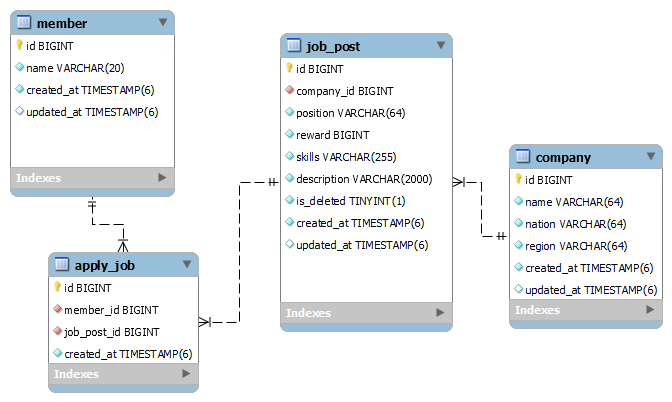
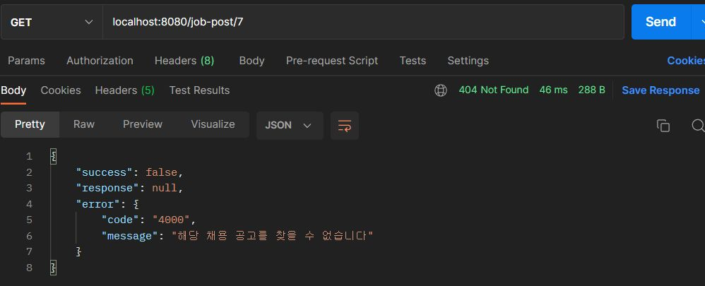
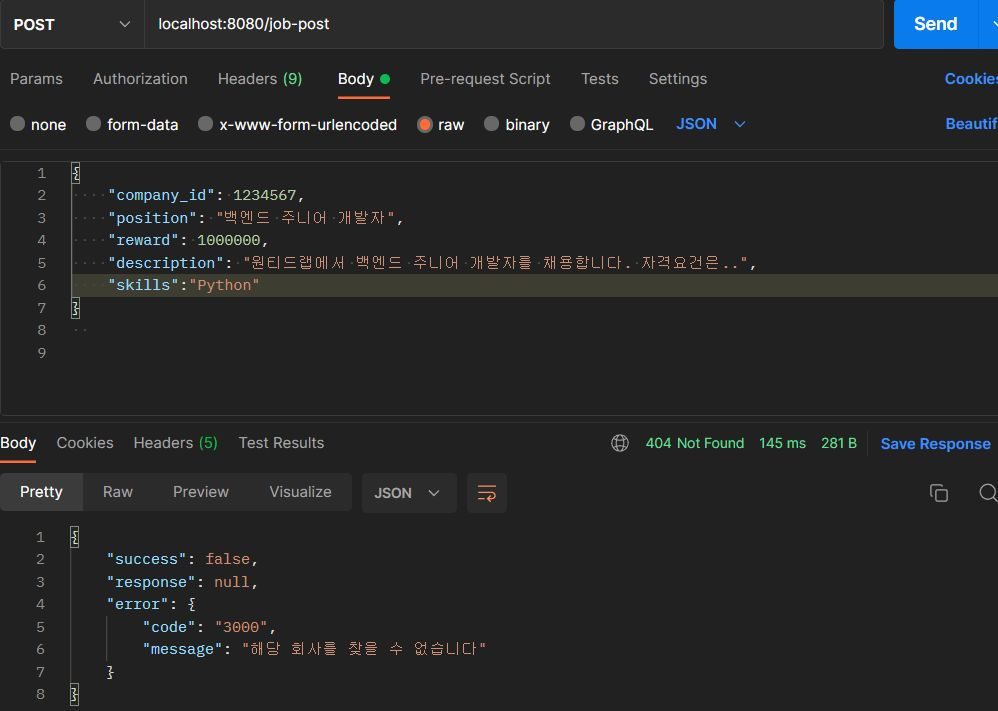

# 프리온보딩 백엔드 인턴십 선발과제

## 프로젝트 소개

서비스 개요

- 본 서비스는 기업의 채용을 위한 웹 서비스 입니다.
- 회사는 채용공고를 생성하고, 이에 사용자는 지원합니다.

기술 스택

- java 11, Spring Boot 2.7.16, Spring Data JPA, MySQL 8.0

DB



- 지원 내역(apply_job)같이 Log 성격의 데이터 테이블은 생성 날짜(created_at) 컬럼만 포함, 이외의 테이블은 생성 날짜와 수정 날짜(updated_at) 컬럼 포함

<br>


## 요구사항 분석 및 구현 과정

목차

0. 공통

1. 채용공고 등록

2. 채용공고 수정

3. 채용공고 삭제

4. 채용공고 목록 조회

   4.1 단순 목록 조회

   4.2 검색 기능

5. 채용 상세 페이지 조회

6. 채용공고 지원

7. 테스트 코드

8. 기타

---

### 0. 공통

#### API 공통 응답

API 응답이 `success`, `response`, `error` 공통된 형식을 가지고 응답됩니다.

- 요청이 성공하면 `success = true` 으로 응답
- 요청이 성공했지만 비즈니스 로직 실행 중 예외가 발생하면 `success = false` 으로 응답

- 입력이 잘 못 됐거나 Internal server error 등의 에러가 발생해도 `success = false` 으로 응답

성공 예시

- 요청이 성공하면 200 OK와 함께 아래처럼 응답 됩니다.

- 같이 반환할 데이터가 있는 API(ex: 조회 함수)는 response에 데이터를 담아 반환됩니다.

```json
{
    "success": true,
    "response": null,
    "error": null
}
```

실패 예시 1. 비즈니스 로직에서 예외가 발생했을 때

- 클라이언트 구분용 필드(code) 와 에러 메시지(message)를 담아 반환합니다.




실패 예시 2. 유효하지 않은 Request Body와 함께 요청할 때

- error message에 유효하지 않은 필드명과 에러 내용을 담아 반환합니다.


<br>

#### API 명세서

| 기능                      | Method | URL                   |
| ------------------------- | ------ | --------------------- |
| 채용공고 등록             | POST   | /job-post             |
| 채용공고 수정             | PUT    | /job-post/{jobPostId} |
| 채용공고 삭제             | DELETE | /job-post/{jobPostId} |
| 모든 채용공고 목록 조회   | GET    | /job-post             |
| 채용공고 검색             | GET    | 개발중                |
| 채용공고 상세 페이지 조회 | GET    | /job-post/{jobPostId} |
| 채용공고 지원             | POST   | /job-post/apply       |

<br>

### 1. 채용 공고 등록


채용 공고 등록 성공


채용 공고 등록 실패 

- 존재하지 않은 회사의 채용 공고를 등록하려 할 때




<br>

### 2. 채용 공고 수정

<br>

### 3. 채용 공고 삭제

<br>

### 4. 채용 공고 목록 조회

#### 4.1 단순 목록 조회


#### 4.2 검색 기능

구현중...

### 5. 채용 상세 페이지 조회


<br>

### 6. 채용 공고 지원

<br>

### 7. 기타