# 프리온보딩 백엔드 인턴십 선발과제

## 프로젝트 소개

서비스 개요

- 본 서비스는 기업의 채용을 위한 웹 서비스 입니다.
- 회사는 채용공고를 생성하고, 이에 사용자는 지원합니다.

기술 스택

- java 11, Spring Boot 2.7.16, Spring Data JPA, MySQL 8.0

DB


- 지원 내역(apply_job)같이 Log 성격의 데이터 테이블은 생성 날짜(created_at) 컬럼만 포함, 이외의 테이블은 생성 날짜와 수정 날짜(updated_at) 컬럼 포함

<br>


## 요구사항 분석 및 구현 과정

목차

0. 공통

1. 채용공고 등록

2. 채용공고 수정

3. 채용공고 삭제

4. 채용공고 목록 조회

   4.1 모든 채용공고 목록 조회

   4.2 검색 기능

5. 채용 상세 페이지 조회

6. 채용공고 지원


---

### 0. 공통

#### 테스트

- Service Layer의 단위 테스트에서 관련 의존성인 Repository를 모킹하고 테스트를 진행했습니다.
  - 성공, 실패 로직에 대한 단위 테스트 작성
- Repository는 따로 정의한 함수에 대해 테스트했습니다.

#### API 공통 응답

API 응답이 `success`, `response`, `error` 공통된 형식을 가지고 응답됩니다.

- 요청이 성공하면 `success = true` 으로 응답
- 요청이 성공했지만 비즈니스 로직 실행 중 예외가 발생하면 `success = false` 으로 응답

- 입력이 잘 못 됐거나 Internal server error 등의 에러가 발생해도 `success = false` 으로 응답

성공 예시

- 요청이 성공하면 200 OK와 함께 아래처럼 응답 됩니다.

- 같이 반환할 데이터가 있는 API(ex: 조회 함수)는 response에 데이터를 담아 반환됩니다.

```json
{
    "success": true,
    "response": null,
    "error": null
}
```

실패 예시 1. 비즈니스 로직에서 예외가 발생했을 때

- 클라이언트 구분용 필드(code) 와 에러 메시지(message)를 담아 반환합니다.


실패 예시 2. 유효하지 않은 Request Body와 함께 요청할 때

- error message에 유효하지 않은 필드명과 에러 내용을 담아 반환합니다.


<br>

#### API 명세서

| 기능                      | Method | URL                   |
| ------------------------- | ------ | --------------------- |
| 채용공고 등록             | POST   | /job-post             |
| 채용공고 수정             | PUT    | /job-post/{jobPostId} |
| 채용공고 삭제             | DELETE | /job-post/{jobPostId} |
| 모든 채용공고 목록 조회   | GET    | /job-post             |
| 채용공고 검색             | GET    | 개발중                |
| 채용공고 상세 페이지 조회 | GET    | /job-post/{jobPostId} |
| 채용공고 지원             | POST   | /job-post/apply       |

<br>

### 1. 채용공고 등록

채용공고 등록 성공


채용공고 등록 실패 

- 존재하지 않은 회사의 채용 공고를 등록하려 할 때


<br>

### 2. 채용공고 수정

모든 요청 필드가 입력될 때만 채용공고를 수정하도록 수정 요청 dto 필드를 `@NotNull` 이나 `@NotBlank` 로 유효성을 검증했습니다.

회사 id외에 필드만 수정될 수 있도록 채용공고의 회사 id와 요청 데이터의 회사 id와 같은지 비교 후 다르면 예외가 발생하도록 구현했습니다.

```java
@Transactional
public void updateJobPost(JobPostUpdateRequest request, long jobPostId) {
    JobPost jobPost = jobPostRepository.findByIdAndIsDeletedFalse(jobPostId)
        .orElseThrow(() -> new ApplicationException(ErrorCode.JOBPOST_NOT_FOUND));

    // 회사 id는 변경할 수 없다
    if(jobPost.getCompany().getId() != request.getCompanyId()) {
        throw new ApplicationException(ErrorCode.UNABLE_TO_UPDATE_FIELDS, " : company_id");
    }

    JobPost newJobPost = request.toEntity(jobPost.getCompany());
    jobPost.update(newJobPost);
    jobPostRepository.save(jobPost);
}
```


채용공고 수정 요청 성공

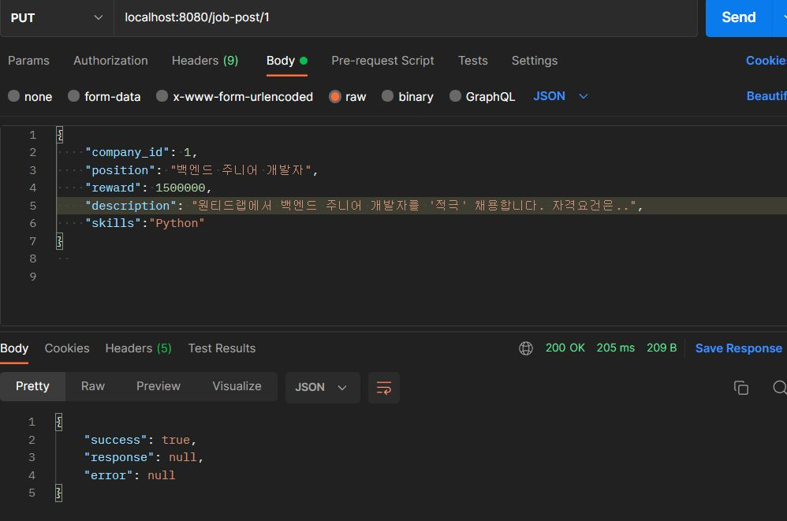


채용공고 수정 요청 실패

- 요청 데이터 중 사용기술(skills)이 빠졌을 때

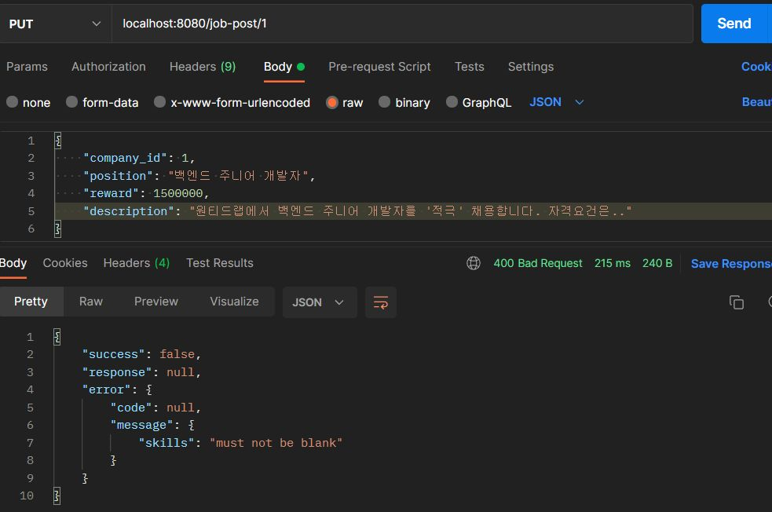


채용공고 수정 요청 실패

- company_id를 기존의 값과 다른 값으로 변경하려할 때

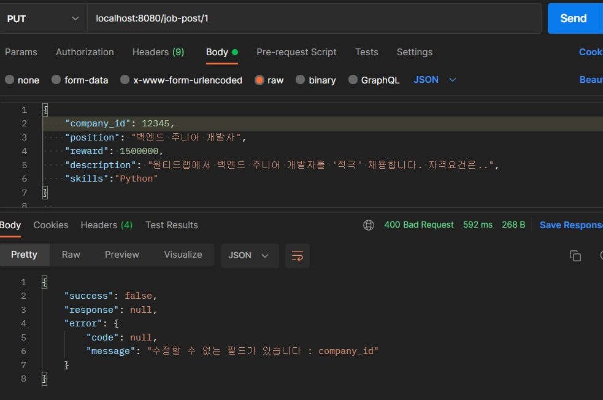

<br>

### 3. 채용공고 삭제

삭제는 soft delete 방식으로 구현 했습니다.

- **과제 요구 조건**과는 상관없지만 실제 서비스에서는 통계 데이터 활용 등 여러 이유로 삭제를 soft delete 방식으로 구현할 수도 있다는 것을 알게 됐고 구현 시 hard delete와의 차이점을 알고 싶어 soft delete방식을 택했습니다.

- 채용공고(job_post)에만 삭제 여부를 판별하는 컬럼 `is_deleted` 을 가집니다.

- JPA 구현체 Hibernate에서 Soft Delete 구현에 도움을 주는 `@SQLDelete` `@Where` 를 제공합니다

  - `@SQLDelete` 으로 entity를 삭제할 때 실행할 쿼리를 지정할 수 있어 `@SQLDelete(sql = "UPDATE job_post SET is_deleted = true WHERE id = ?")`  처럼  `is_delete` 값을 true로 update해서 soft delete를 구현합니다
  - `@Where`을 통해 entity의 조회 쿼리에  `where is_deleted = false` 와 같은 조건을 default로 추가할 수 있습니다.
    - 하지만 실무에서는 경우에 따라서 실제 어떤 데이터가 삭제되었는지 삭제된 데이터도 조회할 수 있어야 해서 `@Where`를 안쓰고 불편해도 직접 JPQL에서 삭제 데이터를 제외하고 조회하거나 애플리케이션에서 제외한다고 합니다.
    - **과제 요구 조건**에는 원래 soft delete에 대한 조건도 없고, 당연히 삭제된 데이터를 조회할 필요가 없어서 `@Where` 만으로 충분합니다. 하지만 `@Where` 안쓰고 구현했을 때를 경험하고 싶어서 필요에 따라 기존에 있던 `findById` 나 `findAll` 함수 말고 추가적인 함수를 정의해 삭제되지 않은 채용공고를 제외하고 조회하거나 Service Layer에서 필터링해서 처리했습니다.

-  다음과 같이 필요에 따라 조회할 때 is_delete = false 인 채용공고만 조회되도록 함수를 정의해서 존재하는 채용공고(=삭제하지 않은 채용공고)를 조회 했습니다.
```java
// JpaRepository.java
Optional<JobPost> findByIdAndIsDeletedFalse(Long id);
```


삭제 성공 응답

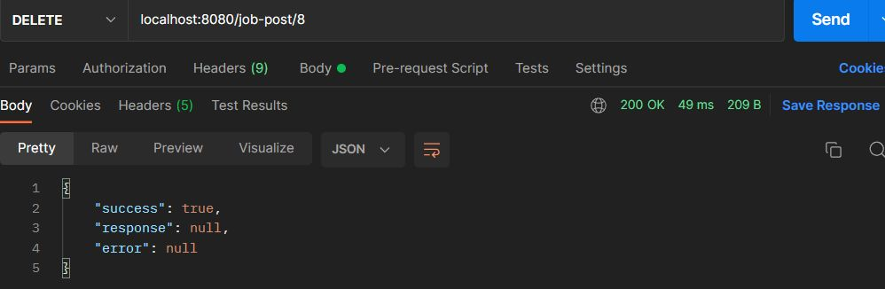

`@SQLDelete`에 의해 delete 쿼리 대신 update쿼리가 실행됐습니다.

```java
// JobPostService.java

@Transactional
public void deleteJobPost(long jobPostId) {
    JobPost jobPost = jobPostRepository.findByIdAndIsDeletedFalse(jobPostId)
                                       .orElseThrow(() -> new ApplicationException(ErrorCode.JOBPOST_NOT_FOUND));
    jobPostRepository.delete(jobPost);
}
```

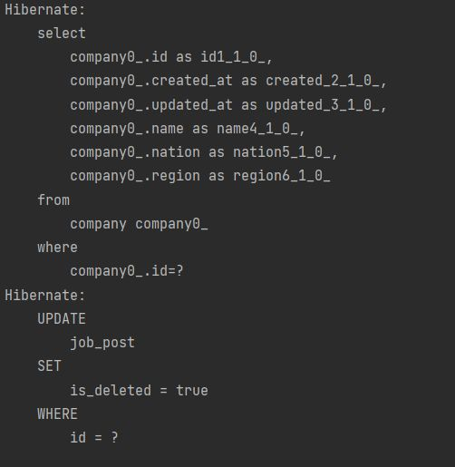

존재하거나 이미 삭제된 채용 공고를 삭제하려 할 때 예외가 발생합니다

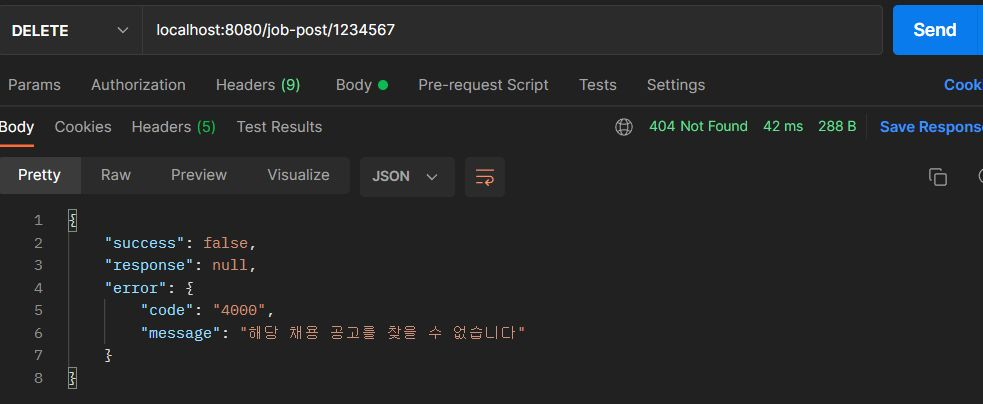

<br>

### 4. 채용공고 목록 조회

#### 4.1 모든 채용공고 목록 조회

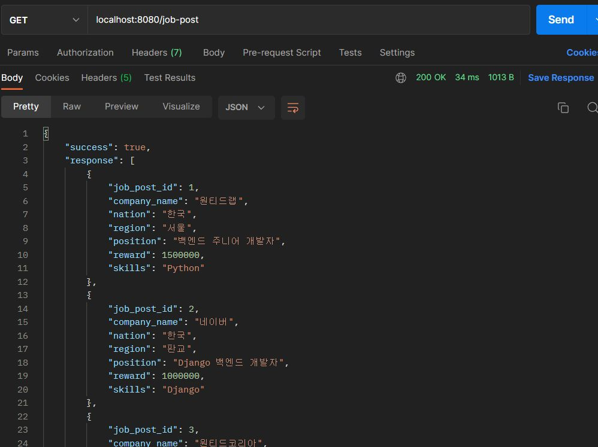

#### 4.2 검색 기능

구현중...

### 5. 채용 상세 페이지 조회

#### 응답 필드로 채용내용 추가

- 채용 상세 페이지 조회에 대한 응답 dto(JobPostDetailResponse)에 채용 내용(description) 필드를 포함해서 반환합니다.

#### 회사가 올린 다른 채용공고

회사와 채용공고가 1:N 연관관계를 가지고 N인 채용공고에서 fk를 가집니다.

다음과 같이 회사 entity 클래스에서 해당 회사가 등록한 채용공고 리스트를 가지도록 정의했습니다.

```java
// Company.java

@OneToMany(mappedBy = "company", fetch = FetchType.LAZY)
private List<JobPost> jobPostList = new ArrayList<>();
```

보통의 경우 위에 코드만으로 충분한데 삭제 구현을 soft delete 방식을 택했기 때문에

jobPostList 에서 삭제되지 않은 채용공고만을 필터링하고 **과제 요구조건**에 맞게 채용공고_id만을 반환하도록 구현했습니다.

```java
// JobPostService.java

@Transactional(readOnly = true)
public JobPostDetailResponse retrieveJobPostDetail(Long jobPostId) {
    JobPost jobPost = jobPostRepository.findByIdAndIsDeletedFalse(jobPostId)
                                       .orElseThrow(() -> new ApplicationException(ErrorCode.JOBPOST_NOT_FOUND));

    List<Long> companyOtherJobPostList = jobPost.getCompany().getJobPostList().stream()
                                                .filter(jp -> !jp.isDeleted())
                                                .map(JobPost::getId)
                                                .collect(Collectors.toList());
    
    return JobPostDetailResponse.of(jobPost, companyOtherJobPostList);
}
```


채용 상세 페이지 조회 성공

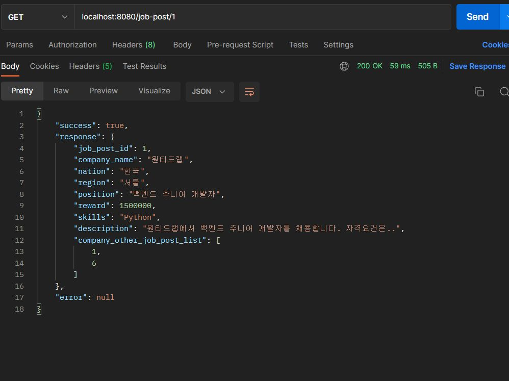

채용공고id 1번으로 조회했을 때 다른 채용공고_id로 6이 나왔고

채용공고_id 6에 대해 채용공고 상세 페이지를 조회하면 다음과 같이 응답합니다.

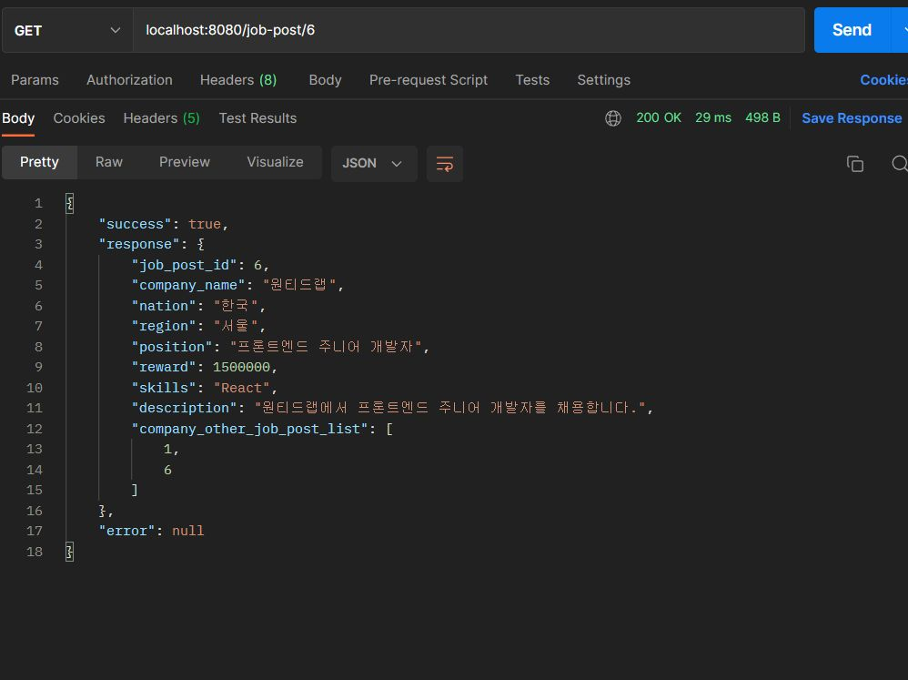

없거나 삭제된 채용공고에 대해 상세 페이지를 조회하면 예외가 발생합니다.


<br>

### 6. 채용공고 지원

**과제 요구 조건**(사용자는 1회만 지원 가능합니다.)에 대해서 단순하게 입력으로 주어진 채용공고_id와 사용자_id와 같은 값을 가지는 지원 내역(apply_job)이 있는지 조회하고 있으면 예외가 발생하도록 구현했습니다.

```java
// ApplyJobService.java

@Transactional
public void applyJobPost(ApplyJobCreateRequest request) {
    JobPost jobPost = jobPostRepository.findByIdAndIsDeletedFalse(request.getJobPostId())
                                       .orElseThrow(() -> new ApplicationException(ErrorCode.JOBPOST_NOT_FOUND));
    Member member = memberRepository.findById(request.getMemberId())
                                    .orElseThrow(() -> new ApplicationException(ErrorCode.MEMBER_NOT_FOUND));

    // 중복 지원 여부 판별
    if(applyJobRepository.findByJobPostAndMember(jobPost, member).isPresent()) {
        throw new ApplicationException(ErrorCode.ALREADY_APPLY_JOBPOST);
    }
    
    ApplyJob applyJob = ApplyJob.builder()
                                .jobPost(jobPost)
                                .member(member)
                                .build();
    
    applyJobRepository.save(applyJob);
}
```

채용공고 지원 성공

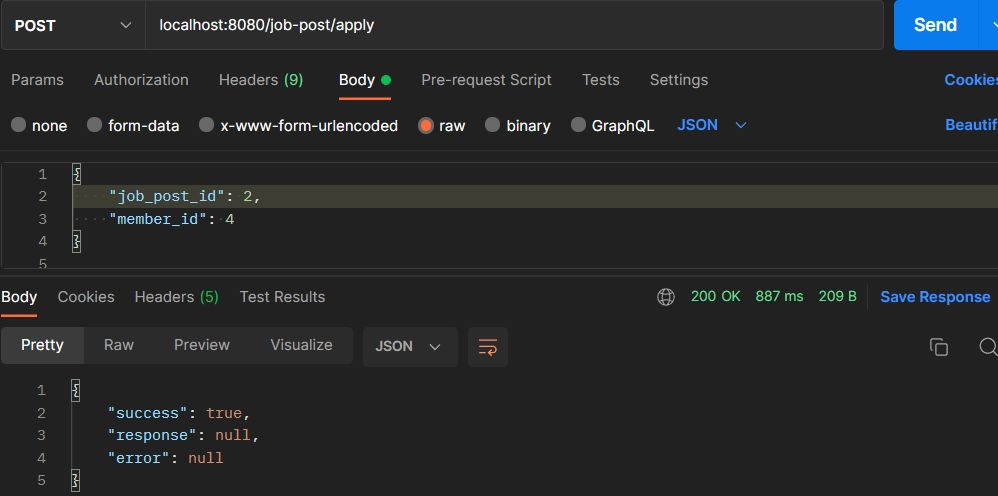

채용공고 지원 실패

- 해당 공고에 이미 지원했을 때

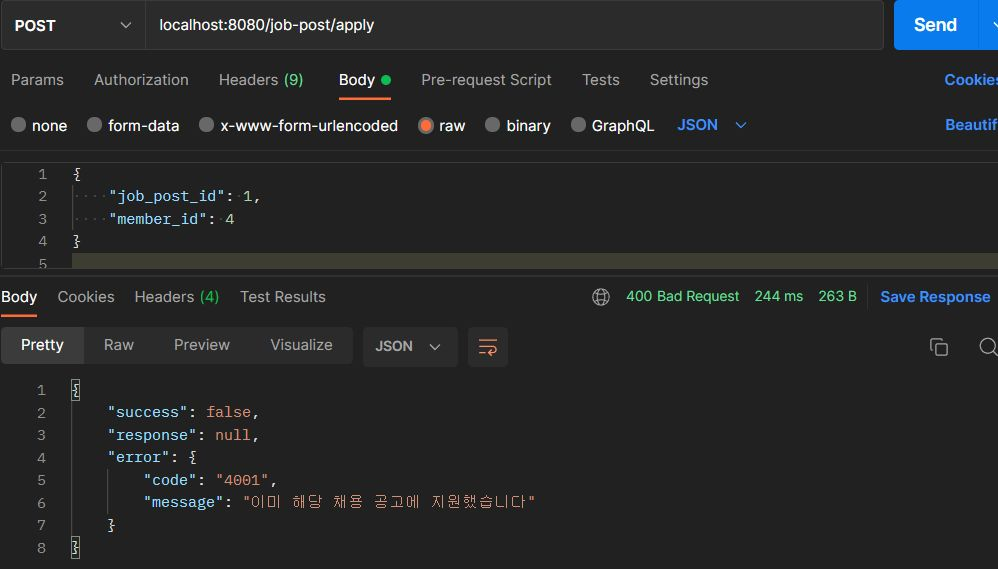

<br>

### TODO

- 검색 기능 구현
- API 문서화