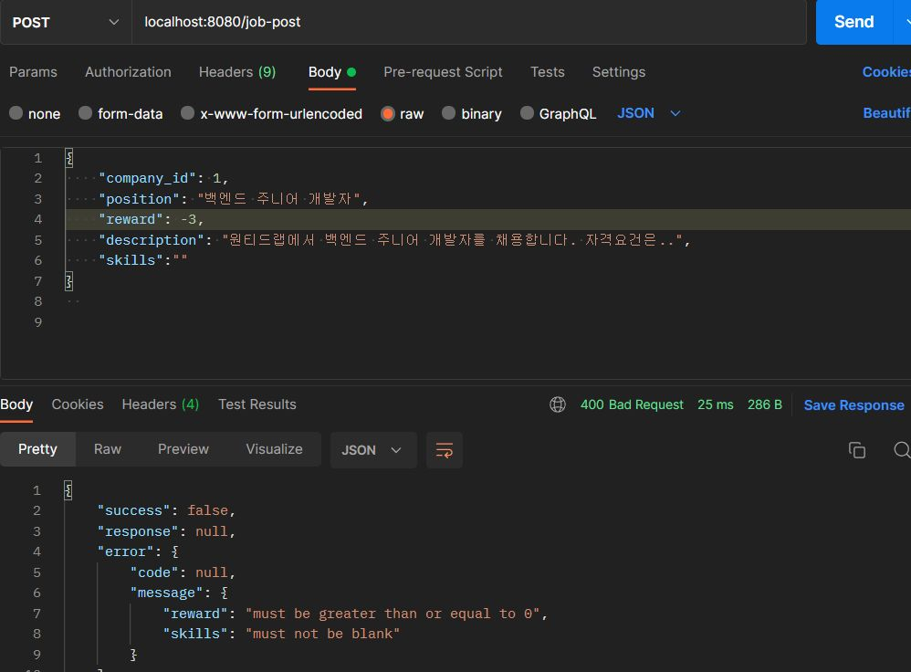

# 프리온보딩 백엔드 인턴십 선발과제

## 프로젝트 소개

서비스 개요

- 본 서비스는 기업의 채용을 위한 웹 서비스 입니다.
- 회사는 채용공고를 생성하고, 이에 사용자는 지원합니다.

기술 스택

- java 11, Spring Boot 2.7.16, Spring Data JPA, MySQL 8.0

DB


- 지원 내역(apply_job)같이 Log 성격의 데이터 테이블은 생성 날짜(created_at) 컬럼만 포함, 이외의 테이블은 생성 날짜와 수정 날짜(updated_at) 컬럼 포함

<br>


## 요구사항 분석 및 구현 과정

목차

0. 공통

1. 채용공고 등록

2. 채용공고 수정

3. 채용공고 삭제

4. 채용공고 목록 조회

   4.1 모든 채용공고 목록 조회

   4.2 검색 기능

5. 채용 상세 페이지 조회

6. 채용공고 지원

7. 테스트 코드

8. 기타

---

### 0. 공통

#### API 공통 응답

API 응답이 `success`, `response`, `error` 공통된 형식을 가지고 응답됩니다.

- 요청이 성공하면 `success = true` 으로 응답
- 요청이 성공했지만 비즈니스 로직 실행 중 예외가 발생하면 `success = false` 으로 응답

- 입력이 잘 못 됐거나 Internal server error 등의 에러가 발생해도 `success = false` 으로 응답

성공 예시

- 요청이 성공하면 200 OK와 함께 아래처럼 응답 됩니다.

- 같이 반환할 데이터가 있는 API(ex: 조회 함수)는 response에 데이터를 담아 반환됩니다.

```json
{
    "success": true,
    "response": null,
    "error": null
}
```

실패 예시 1. 비즈니스 로직에서 예외가 발생했을 때

- 클라이언트 구분용 필드(code) 와 에러 메시지(message)를 담아 반환합니다.


실패 예시 2. 유효하지 않은 Request Body와 함께 요청할 때

- error message에 유효하지 않은 필드명과 에러 내용을 담아 반환합니다.



<br>

#### API 명세서

| 기능                      | Method | URL                   |
| ------------------------- | ------ | --------------------- |
| 채용공고 등록             | POST   | /job-post             |
| 채용공고 수정             | PUT    | /job-post/{jobPostId} |
| 채용공고 삭제             | DELETE | /job-post/{jobPostId} |
| 모든 채용공고 목록 조회   | GET    | /job-post             |
| 채용공고 검색             | GET    | 개발중                |
| 채용공고 상세 페이지 조회 | GET    | /job-post/{jobPostId} |
| 채용공고 지원             | POST   | /job-post/apply       |

<br>

### 1. 채용공고 등록

채용공고 등록 성공


채용공고 등록 실패 

- 존재하지 않은 회사의 채용 공고를 등록하려 할 때


<br>

### 2. 채용공고 수정

채용공고 수정 API의 HTTP Method를 PUT으로 택해서 요청 필드가 비어 있지 않을 때 채용공고를 수정하도록 했습니다.


<br>

### 3. 채용공고 삭제

삭제는 soft delete 방식으로 구현 했습니다.

- **과제 요구 조건**과는 상관없지만 실제 서비스에서는 통계 데이터 활용 등 여러 이유로 삭제를 soft delete 방식으로 구현할 수도 있다는 것을 알게 됐고 구현 시 hard delete와의 차이점을 알고 싶어 soft delete방식을 택했습니다.
- 채용공고(job_post)에만 삭제 여부를 판별하는 컬럼 `is_deleted` 을 가집니다.
- JPA 구현체 Hibernate에서 Soft Delete 구현에 도움을 주는 `@SQLDelete` `@Where` 를 제공합니다
  - `@SQLDelete` 으로 entity를 삭제할 때 실행할 쿼리를 지정할 수 있어 `@SQLDelete(sql = "UPDATE job_post SET is_deleted = true WHERE id = ?")`  처럼  `is_delete` 값을 true로 update해서 soft delete를 구현합니다
  - `@Where`을 통해 entity의 조회 쿼리에  `where is_deleted = false` 와 같은 조건을 default로 추가할 수 있습니다.
    - 하지만 실무에서는 경우에 따라서 실제 어떤 데이터가 삭제되었는지 삭제된 데이터도 조회할 수 있어야 해서 `@Where`를 안쓰고 불편해도 직접 JPQL에서 삭제 데이터를 제외하고 조회하거나 애플리케이션에서 제외한다고 합니다.
    - **과제 요구 조건**에는 원래 soft delete에 대한 조건도 없고, 당연히 삭제된 데이터를 조회할 필요가 없어서 `@Where` 만으로 충분합니다. 하지만 `@Where` 안쓰고 구현했을 때를 경험하고 싶어서 필요에 따라 기존에 있던 `findById` 나 `findAll` 함수 말고 추가적인 함수를 정의해 삭제되지 않은 채용공고를 제외하고 조회하거나 Service Layer에서 필터링해서 처리했습니다.

삭제 성공 응답


`@SQLDelete`에 의해 delete 쿼리 대신 update쿼리가 실행됐습니다.

```java
// JobPostService.java
// ... 생략 ...

@Transactional
public void deleteJobPost(long jobPostId) {
    JobPost jobPost = jobPostRepository.findByIdAndIsDeletedFalse(jobPostId)
                                       .orElseThrow(() -> new ApplicationException(ErrorCode.JOBPOST_NOT_FOUND));
    jobPostRepository.delete(jobPost);
}

// ... 생략 ...
```


존재하거나 이미 삭제된 채용 공고를 삭제하려 할 때 예외가 발생합니다


<br>

### 4. 채용공고 목록 조회

#### 4.1 모든 채용공고 목록 조회


#### 4.2 검색 기능

구현중...

### 5. 채용 상세 페이지 조회

#### 응답 필드로 채용내용 추가

#### 회사가 올린 다른 채용공고

회사와 채용공고가 1:N 연관관계를 가지고 N인 채용공고에서 fk를 가집니다.

다음과 같이 회사 entity 클래스에서 해당 회사가 등록한 채용공고 리스트를 가지도록 정의했습니다.

```java
// Company.java
// ... 생략 ...

@OneToMany(mappedBy = "company", fetch = FetchType.LAZY)
private List<JobPost> jobPostList = new ArrayList<>();

// ... 생략 ...
```

보통의 경우 위에 코드만으로 충분한데 삭제 구현을 soft delete 방식을 택했기 때문에

jobPostList 에서 삭제되지 않은 채용공고만을 필터링하고 **과제 요구조건**에 맞게 채용공고_id만을 반환하도록 구현했습니다.

```java
@Transactional(readOnly = true)
public JobPostDetailResponse retrieveJobPostDetail(Long jobPostId) {
	JobPost jobPost = jobPostRepository.findByIdAndIsDeletedFalse(jobPostId)
                                       .orElseThrow(() -> new ApplicationException(ErrorCode.JOBPOST_NOT_FOUND));

	List<Long> companyOtherJobPostList = jobPost.getCompany().getJobPostList().stream()
    											.filter(jp -> !jp.isDeleted())
                                                .map(JobPost::getId)
                                                .collect(Collectors.toList());

	return JobPostDetailResponse.of(jobPost, companyOtherJobPostList);
}
```


채용 상세 페이지 조회 성공


채용공고id 1번으로 조회했을 때 다른 채용공고_id로 6이 나왔고

채용공고_id 6에 대해 채용공고 상세 페이지를 조회하면 다음과 같이 응답합니다.


없거나 삭제된 채용공고에 대해 상세 페이지를 조회하면 예외가 발생합니다.


<br>

### 6. 채용 공고 지원


<br>

### 7. 기타